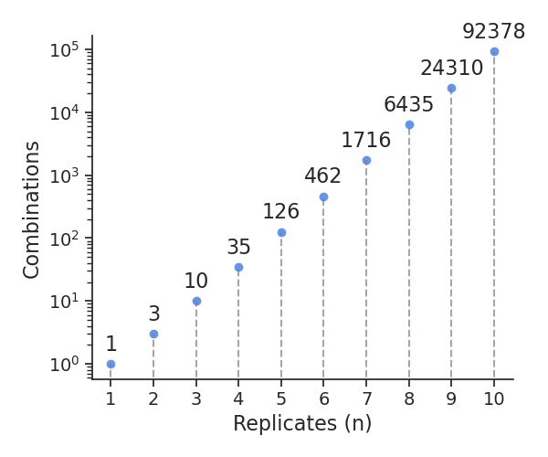

# BootstrapSeq

(Pre-release version)

Bootstrap resample your low-powered RNA-Seq data set to estimate the expected reliability of downstream differential expression and enrichment results. Briefly, users provide a raw count matrix and a design matrix. Users must additionally have edgeR installed. The notebook will run bootstrapped differential expression analyses and compute the Spearman rank correlations for logFC estimates obtained from the bootstrapped and original data sets.

In Degen and Medo (2025), we show that data sets with a high (>0.9) Spearman correlation have overall higher precision, recall, and replicability. Conversely, data sets with a low (<0.8) correlation are prone to false positives and low replicability. The figure below shows our results for 18 different data sets.

## Instructions

### Option 1: Snakemake

1. Install Snakemake

2. Edit configs/config.yaml as needed

3. From the project root, run: `snakemake --cores 4` (adjust number of cores as needed)

The workflow will create a merged table with edgeR differential expression results from all trials, as well as a json file with summary statistics from calculated Spearman corelations.

### Option 2: Jupyter Notebook

A Jupyter notebook with further instructions can be found in [workflow/notebooks/bootstrapseq.ipynb](.workflow/notebooks/bootstrapseq.ipynb). This option does not support parallelization for now.

### Option 3: Docker Image

Coming soon...

### Number of bootstrap trials

In our original study, we limited the bootstrapping to $k=25$ trials because of the large (1'800) number of cohorts we studied. However, in real world scenarios where practitioners have a handful of data sets at best, the number of trials can be readily increased.

In a data set with $n$ biological replicates, the number of distinct bootstrap trials is ${2n-1 \choose n}$, as shown in the figure below for $n$ up to 10. For data sets with $n=5$, exhausting all possible combinations is easily achievable and should only take a few minutes when running on multiple cores.

## To do

- Let user call own R or Python script to perform DEA

- Recommend number of trials based on variability of Spearman metric

- Option to exhaust all combinations instead of random sampling