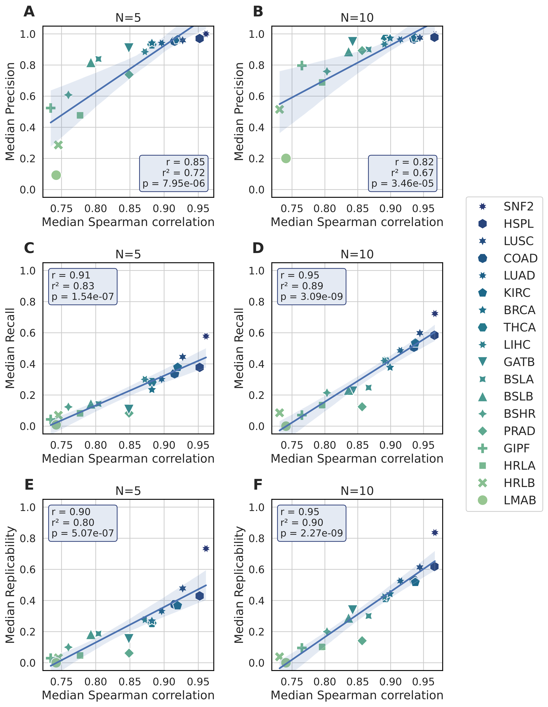

# BootstrapSeq

Bootstrap resample your small-powered RNA-Seq data set to estimate the expected reliability of downstream differential expression and enrichment results.

## Instructions

This pre-release version is provided as a Jupyter notebook with further instructions, see [src/bootstrapseq.ipynb](./src/bootstrapseq.ipynb). A Python package and Docker image may be released later.

Briefly, users provide a raw count matrix and optionally a design matrix. Users must additionally have either edgeR or DESeq2 installed. The notebook will run bootstrapped differential expression analyses and compute the Spearman rank correlations for logFC estimates obtained from the bootstrapped and original data sets.

In Degen and Medo (2025), we show that data sets with high (>0.85) Spearman correlation have overall higher precision, recall, and replicability. The Figure below shows our results for 18 different data sets.

